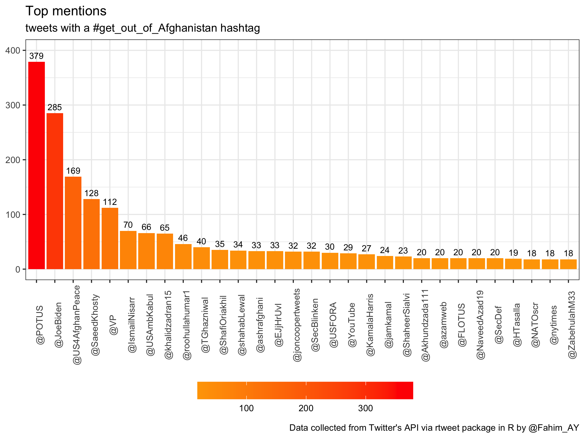

# tweets with a "get_out_of_Afghanistan" hashtag


## Loading reqired packages
```
library(rtweet)
library(tidyverse)
library(tidytext)
```

## search tweets

```
df <- search_tweets(
  "#افغانستان_را_رها_نماید OR #افغانستان_پریږدئ OR #get_out_of_Afghanistan",
  n = 18000,
  type = "mixed",
  parse = TRUE
)

saveRDS(df, "df.RDS")
saveRDS(df_users, "df_users.RDS")
```

## Timeline of tweets

```
Subtitle <- "tweets with a #get_out_of_Afghanistan hashtag"
Caption <- "Data collected from Twitter's API via rtweet package in R by @Fahim_AY"

Timeline_of_tweets <- ts_plot(df, "hours", color = "orange") +
  geom_point(color = "darkred") +
  labs(x = NULL, y = NULL,
       title = "Frequency of tweets",
       subtitle = Subtitle,
       caption = Caption
       ) +
  theme_minimal()

Timeline_of_tweets
```


## Frequency of tweets, by language

```
frequency_of_tweets_by_language <- table(df$lang) %>% 
  data.frame() %>% 
  arrange(Freq) %>% 
  left_join(langs, by = c("Var1" = "alpha")) %>% 
  mutate(language = case_when(
    english == "English" ~ "1: English",
    english == "Pushto; Pashto" ~ "2: Pashto",
    english == "Persian" ~ "3: Persian",
    TRUE ~ "4: Other"
  )) %>% 
  group_by(language) %>% 
  summarize(Freq = sum(Freq)) %>% 
  ungroup() %>% 
  ggplot(aes(x = language, y = Freq, fill = language)) +
  geom_col() +
  geom_text(aes(label = Freq), color = "white", vjust = 1.5) +
  theme_bw() +
  theme(legend.position = "bottom") +
  scale_fill_ordinal() +
  labs(x = NULL, y = NULL, fill = "Language",
       title = "Frequency of tweets, by language",
       subtitle = Subtitle,
       caption = Caption
  )

frequency_of_tweets_by_language
```


## Top tweeting location

```
top_tweeting_location <- df %>% 
  filter(!is.na(place_full_name)) %>% 
  count(place_full_name, sort = TRUE) %>% 
  mutate(country = case_when(
    grepl("Pakistan", place_full_name) ~ "1: Pakistan",
    grepl("Afghanistan", place_full_name) ~ "2: Afghanistan",
    TRUE ~ "3: Other"
  )) %>% 
  ggplot(aes(x = reorder(place_full_name, n), y = n, fill = country)) +
  geom_col() +
  coord_flip() +
  theme_bw() +
  theme(legend.position = "top", plot.title.position = "plot") +
  labs(x = NULL, y = NULL, fill = NULL,
      title = "Top tweeting location",
      subtitle = paste0(Subtitle, "\nfiltered: tweets where the location is mentioned"),
      caption = Caption
      ) +
  scale_fill_ordinal(option = "D")

top_tweeting_location
```


## Top tweeters

```
top_tweeters <- df %>% 
  count(screen_name, sort = TRUE) %>%
  # filter(n >=5) %>% 
  top_n(n = 20) %>% 
  mutate(screen_name = paste0("@", screen_name)) %>% 
  ggplot(aes(x = reorder(screen_name, n), y = n, fill = n)) +
  geom_col() +
  geom_text(aes(label = n), color = "white", hjust = 1.5) +
  coord_flip() +
  scale_fill_gradient2(low = "white", mid = "orange", high = "darkred") +
  theme_bw() +
  theme(legend.position = "bottom", legend.key.width = unit(1.5, "cm")) +
  labs(x = NULL, y = NULL, fill = NULL,
       title = "Top tweeters",
       subtitle = paste0(Subtitle, "\nfiltered: tweeters with more than 20 tweets"),
       caption = Caption
  )

top_tweeters
```


## Top mentions

```
top_mentions <- df %>% 
  unnest_tokens(mentions, text, "tweets", to_lower = FALSE) %>%
  filter(str_detect(mentions, "^@")) %>%  
  count(mentions, sort = TRUE) %>% 
  # filter(n>=2) %>% 
  top_n(n = 30) %>% 
  ggplot(aes(x = reorder(mentions, -n), y = n, fill = n)) +
  geom_col() +
  geom_text(aes(label = n), color = "black", vjust = -0.5, size = 3) +
  theme_bw() +
  theme(legend.position = "bottom", legend.key.width = unit(1.5, "cm"), axis.text.x = element_text(angle = 90)) +
  scale_fill_gradient(low = "orange", high = "red") +
  labs(x = NULL, y = NULL, fill = NULL,
       title = "Top mentions",
       subtitle = Subtitle,
       caption = Caption
       ) +
  ylim(c(0, 300))

top_mentions
```




